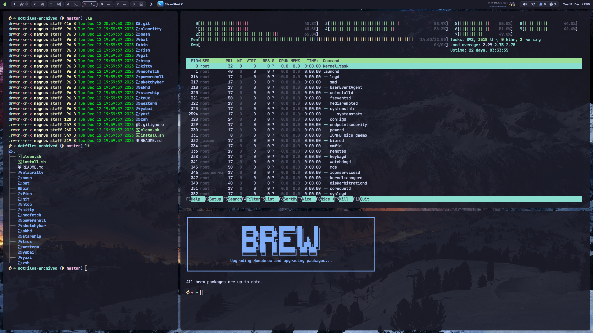

# TheM4gnus dotfiles



This is the home of my old dotfiles.

I decided to archive my current dotfiles repository and start fresh in a new one. The reason behind this is that the current repository has become bloated from my experimentation and learning.

My new [dotfiles](https://github.com/TheM4gnus/dotfiles)

## Software

- Terminals: [alacritty](https://alacritty.org/), [kitty](https://sw.kovidgoyal.net/kitty/), [wezterm](https://wezfurlong.org/wezterm)
- Shells: [fish](https://fishshell.com), [zsh](https://zsh.sourceforge.io/)
- Shell Prompt : [starship](https://starship.rs/)
- Multiplexer: [tmux](https://github.com/tmux/tmux/wiki)
- Window Manager : [yabai](https://github.com/koekeishiya/yabai)
- Hotkey Daemon : [skhd](https://github.com/koekeishiya/skhd)
- Status Bar : [sketchybar](https://github.com/FelixKratz/SketchyBar)


## Installation

### Fonts

```sh
brew tap homebrew/cask-fonts
brew install font-jetbrains-mono-nerd-font
```

### Alacritty

```sh
brew install --cask alacritty
```

### Kitty

```sh
brew install --cask kitty
```

### Wezterm

```sh
brew install --cask wezterm
```

### Fish

```sh
brew install fish
```

### Zsh

```sh
brew install zsh
```

### Starship

```sh
brew install starship
```

### Tmux

Install Tmux and Dependencies
```sh
brew install tmux bash zoxide fzf
```

Install Plugin Manager
```sh
git clone https://github.com/tmux-plugins/tpm ~/.config/tmux/plugins/tpm

# type this in terminal if tmux is already running
tmux source ~/.config/tmux/tmux.conf
```

> Install all plugins with: **Control-b and then shift i**

### Yabai

[Install yabai](https://github.com/koekeishiya/yabai/wiki)
```sh
brew install koekeishiya/formulae/yabai
yabai --start-service
```


### Skhd

[Install skhd](https://github.com/koekeishiya/skhd)
```sh
brew install koekeishiya/formulae/skhd
skhd --start-service
```


### SketchyBar
Config taken from : https://github.com/FelixKratz/dotfiles/blob/master/README.md

Install Dependencies
```sh
brew install --cask sf-symbols
brew install jq
brew install gh
brew install switchaudio-osx
curl -L https://github.com/kvndrsslr/sketchybar-app-font/releases/download/v1.0.16/sketchybar-app-font.ttf -o $HOME/Library/Fonts/sketchybar-app-font.ttf
```

Install SketchyBar
```sh
brew tap FelixKratz/formulae
brew install sketchybar
```

Run the bar automatically at startup:
```sh
brew services start sketchybar
```